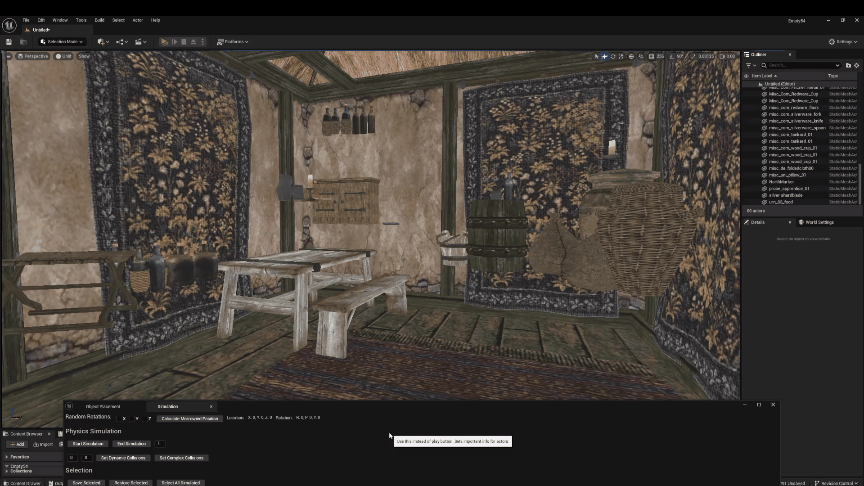

# Unreal Engine 5.4.4 Morrowind Modding Plugin  
*Big thank-you to the brilliant minds behind the tools and libraries that made this project possible: BSApack, ESMTool, Niflib, TES3conv and Texconv.*

Welcome to a new approach in modding Morrowind. It’s an alternative toolkit designed to empower you to build, enhance, or meticulously curate your own interior levels with finesse and flair. (Fear not, exterior tools are on the horizon, so stay tuned!)

### What Awaits You  
Dive into a suite of features that blend nostalgia with little bit of Unreal magic:  
- **Object Placement Reimagined**: Channel the spirit of the TES Construction Set Object Window, complete with search functionality. Drag, drop, and position your assets with ease.  
- **Precision with Physics**: Fine-tune your placements using Unreal’s physics simulation—no more guesswork, just pixel-perfect results.  
- **Custom Snapping Tool**: Uses bounding boxes, good for ceiling, wall placement. Just set the proper axes and hold C when dragging. (alt is occupied sadly) 
- **Selection Helper Tool**: For faster selection of same objects or simulated ones.  
- **Mesh Overlap Detection**: Programmatically scan your meshes for collisions(even entire level if you have time), with a configurable threshold to catch only the overlaps that matter. Say goodbye to pesky bleeding!  
- **Smart Tools for Speed**: Duplicate objects or drop them into your scene with randomized rotations—tweak the chaos to your liking.  
- **Prefab Power**: Build reusable collections of objects or craft palettes for different interior vibes. Your favorite setups are now just a few clicks away.  
- **ESP Import (esp->json->unreal for now)**: When you want to create your build whole new Cell or just curate overlaps.  
- **ESP Export (unreal->json->esp for now)**: When your masterpiece is complete, export your level to an `.esp` file, ready to shine in the wild.

### Cons
- Early alpha version, not production ready. Please report bugs. 
- **Modifying Input ESM/ESP Records**: This is an object placement tool, not an editor for existing records.  
- Easily switching support for .esm files. Default set for Morrowind.esm, Tribunal.esm, Bloodmoon.esm and Tamriel_Data.esm. Can be altered with habasi and custom esmtool.
- Set any record on export to something else than temporary: "true", can be fixed in json file though.
- Couple of meshes won't import or there are some texture issues (mostly TR, working on direct .nif to unreal importer where I fix these).
- Weird looking creatures and fallback mesh for NPCs (just cosmetics, placing still working fine in game).
- UI bugs
- And A LOT of things and bugs I don't know about yet.
  
### Download Links
- https://www.mediafire.com/file/2dp75gorb4cgboi/00_Empty54.zip/file
- https://mega.nz/file/huhkBTJA#WiaArnzmhak6SfDEyag965uQzEYGYLtKtSU8Dx4Oz3Q
  
### Installation
1. Install Unreal Engine 5.4.4
2. Extract unreal project 00_Empty54.zip file
3. Copy Tamriel_Data (if you really want to use meshes from it) meshes and textures folders to /Data Files/_unrealfolder/extracted (script expects all other .bsa files in /Data Files folder)
4. Edit paths in initscript.py script in 00_Empty54/Plugins/unrealMW/Resources folder and run it
5. Run Empty54.uproject and yes to compile
6. Done, you should see empty level and plugin window with tabs

### Tips/Notes
- Read tooltips.
- If you ever close plugin window, click window->unrealMW (last one)
- use unlit mode only (better performance and no need to try lighten your scene)
- r.SetNearClipPlane 3 - (or your custom value) use this console command to adjust cliping plane to be able to check bleedings better.
- Grid snapping and agle snapping is built in UE, use for better object placement.
- Use ctrl+shift+s save for saving imported assets or on next start there are going to be empty actors in your saved level only(you can export and reimport the level if you fk up).
- Don't ever use ctrl+c and ctrl+v to duplicate actors. Use ctrl+d or alt+drag(click, hold and drag arrow in transform mode(hotkey "W")) instead. Unreal generates unique actors name and it won't match correct Morrowind ID. Also if object holds ref number there are going to be duplicates. Use ctrl+d, alt+drag and object placement only.
- Shift+LMClick for selecting another actor, ESC for deselect.
- F for focus on selected actor.
- When holding RMButton you can adjust floating speed with your mouse wheel.
- When moving object you can hold shift to move with it.
- Console Commands for getting single .esp from .esm or using tes3conv tools
- .\tes3cellexport.exe 'C:\Games\Morrowind\Data Files\Morrowind.esm' ..\..\Plugins\Nissintu.json Nissintu
- .\tes3conv.exe ..\..\Plugins\export.json ..\..\Plugins\NissintuCustom.esp
- .\tes3conv.exe ..\..\Plugins\Nissintu.esp ..\..\Plugins\Nissintujson.json
